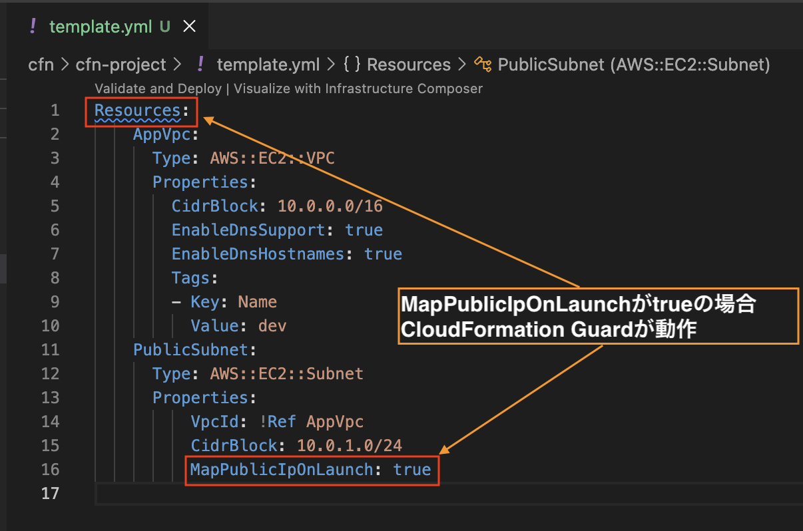

# 【AWS】検証！CloudFormation IDE Experience

## はじめに

この記事では「この前リリースされた機能って実際に動かすとどんな感じなんだろう」とか「もしかしたら内容次第では使えるかも？？」などAWSサービスの中でも特定の機能にフォーカスして検証していく記事です。

主な内容としては実践したときのメモを中心に書きます。（忘れやすいことなど）
誤りなどがあれば書き直していく予定です。

今回はCloudFormation IDE Experienceを検証してみます。

## 今のCDKじゃねぇ、CloudFormationだ

AWS CDKやTerraformなどのIaCツールが普及してきていますが、やはりCloudFormationを直接使いたいというニーズも根強くあります。
例えば以下のようなケースです。

- 既存のCloudFormationテンプレートを活用したい
- IaCツールを導入するほどではないが、CloudFormationでインフラを管理したい
- IaCツールの学習コストを避けたい

あるいはIaC個々の辛みを避けるために、CloudFormationを選択する場合もあります。
Terraformの状態管理の煩雑さや、CDKのバージョンアップに伴う互換性問題などが挙げられます。

と言ってもCloudFormationにも落とし穴があります。
例えば以下のような問題です。

- テンプレートの記述ミスや構文エラーの検出が難しい
- リソース間の依存関係の把握が困難
- 大規模なテンプレートの管理が複雑
- json/yamlの記述が煩雑でミスが発生しやすい

筆者はyamlで書くことが多く、基本的には自動生成されたものを修正して使うことが多いのですが、やはりミスが発生しやすいです。
言語サーバー（LSP）やリンターがあったら便利だなと思っていたところに、今回のCloudFormation IDE Experienceの発表がありました。

## CloudFormation IDE Experience とは

簡単に説明すると、CloudFormationテンプレートの作成と管理を支援するためのIDE（統合開発環境）向けの機能セットです。これにより、開発者はCloudFormationテンプレートをより効率的に作成、編集、デバッグできるようになります。

公式ブログには以下のように説明されています。

> IDE内でエンドツーエンドの開発ループを構築することで、コードとしてのインフラストラクチャの構築方法を刷新します。一般的なYAMLやJSONエディタとは異なり、これはインフラストラクチャ開発者向けに特別に構築されたCloudFormationファーストのソリューションです。
※一部抜粋して翻訳

[引用：Announcing CloudFormation IDE Experience: End-to-End Development in Your IDE](https://aws.amazon.com/jp/blogs/devops/announcing-cloudformation-ide-experience-end-to-end-development-in-your-ide/)

なお、この機能を利用するには、拡張機能としてAWS ToolkitをIDEにインストールする必要があります。

## セットアップ

まずはAWS ToolkitをVSCodeの拡張機能としてインストールします。

[AWS Toolkit - VSCode Marketplace](https://marketplace.visualstudio.com/items?itemName=AmazonWebServices.aws-toolkit-vscode)

## ハンズオン



## まとめ

## 参考

- [Announcing CloudFormation IDE Experience: End-to-End Development in Your IDE](https://aws.amazon.com/jp/blogs/devops/announcing-cloudformation-ide-experience-end-to-end-development-in-your-ide/)
- [Accelerate infrastructure development with AWS CloudFormation intelligent authoring in IDEs](https://aws.amazon.com/jp/about-aws/whats-new/2025/11/aws-cloudformation-intelligent-authoring-ides/)
- [AWS CloudFormation language server](https://docs.aws.amazon.com/AWSCloudFormation/latest/UserGuide/ide-extension.html)

## AWS CLI インストールと SSO ログイン手順 (Linux環境)

このガイドでは、Linux環境でAWS CLIをインストールし、AWS SSOを使用してログインするまでの手順を説明します。

## 前提条件

- Linux環境（Ubuntu、CentOS、Amazon Linux等）
- インターネット接続
- 管理者権限（sudoが使用可能）
- AWS SSO が組織で設定済み
- Python 3.12.1

## AWS CLI のインストール

### 公式インストーラーを使用（推奨）

最新版のAWS CLI v2を公式インストーラーでインストールします。

```bash
# 1. インストーラーをダウンロード
curl "https://awscli.amazonaws.com/awscli-exe-linux-$(uname -m).zip" -o "awscliv2.zip"

# 2. unzipがインストールされていない場合はインストール
sudo apt update && sudo apt install unzip -y  # Ubuntu/Debian系
# または
sudo yum install unzip -y                     # CentOS/RHEL系

# 3. ダウンロードしたファイルを展開
unzip awscliv2.zip

# 4. インストール実行
sudo ./aws/install

# 5. インストール確認
aws --version

# ダウンロードしたzipファイルと展開したディレクトリを削除してクリーンアップします。
rm  "awscliv2.zip"

# 解凍したディレクトリを削除
rm -rf aws
```

## AWS SSO の設定とログイン

### 1. AWS SSO の設定

AWS SSOを使用するための初期設定を行います。

```bash
aws configure sso
```

設定時に以下の情報の入力が求められます：

- **SSO start URL**: 組織のSSO開始URL（例：`https://my-company.awsapps.com/start`）
- **SSO Region**: SSOが設定されているリージョン（例：`us-east-1`）
- **アカウント選択**: 利用可能なAWSアカウントから選択
- **ロール選択**: 選択したアカウントで利用可能なロールから選択
- **CLI default client Region**: デフォルトのAWSリージョン（例：`ap-northeast-1`）
- **CLI default output format**: 出力形式（`json`、`text`、`table`のいずれか）
- **CLI profile name**: プロファイル名（`default`とします。）

### 2. AWS SSO ログイン

設定完了後、以下のコマンドでログインを実行します。

```bash
aws sso login
```

ログイン時の流れ：
1. コマンド実行後、ブラウザが自動的に開きます
2. AWS SSOのログインページが表示されます
3. 組織のIDプロバイダー（例：Active Directory、Okta等）でログイン
4. 認証が成功すると、ターミナルに成功メッセージが表示されます

### 3. ログイン状態の確認

認証情報を確認します。

```bash
aws sts get-caller-identity
```

正常にログインできている場合、以下のような情報が表示されます：

```json
{
    "UserId": "AROAXXXXXXXXXXXXXX:username@company.com",
    "Account": "123456789012",
    "Arn": "arn:aws:sts::123456789012:assumed-role/RoleName/username@company.com"
}
```

## トラブルシューティング

### よくある問題と解決方法

#### 1. ブラウザが開かない場合

```bash
# 手動でブラウザを開く場合のURL確認
aws sso login --no-browser
```

表示されたURLを手動でブラウザで開いてください。

#### 2. セッションが期限切れの場合

```bash
# 再ログイン
aws sso login
```

#### 4. プロキシ環境での設定

プロキシ環境の場合、以下の環境変数を設定してください：

```bash
export HTTP_PROXY=http://proxy.company.com:8080
export HTTPS_PROXY=http://proxy.company.com:8080
export NO_PROXY=localhost,127.0.0.1,.company.com
```

## セキュリティのベストプラクティス

1. **定期的な認証情報の更新**: SSOセッションには有効期限があります。定期的に再ログインを行ってください。

2. **最小権限の原則**: 必要最小限の権限を持つロールを使用してください。

3. **プロファイルの分離**: 本番環境と開発環境で異なるプロファイルを使用してください。

4. **ログアウト**: 作業終了時は適切にログアウトしてください：
   ```bash
   aws sso logout --profile <プロファイル名>
   ```

## 参考リンク

- [AWS CLI ユーザーガイド](https://docs.aws.amazon.com/cli/latest/userguide/)
- [AWS SSO ユーザーガイド](https://docs.aws.amazon.com/singlesignon/latest/userguide/)
- [AWS CLI インストールガイド](https://docs.aws.amazon.com/cli/latest/userguide/getting-started-install.html)
